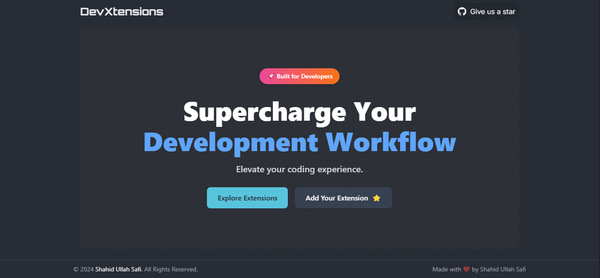
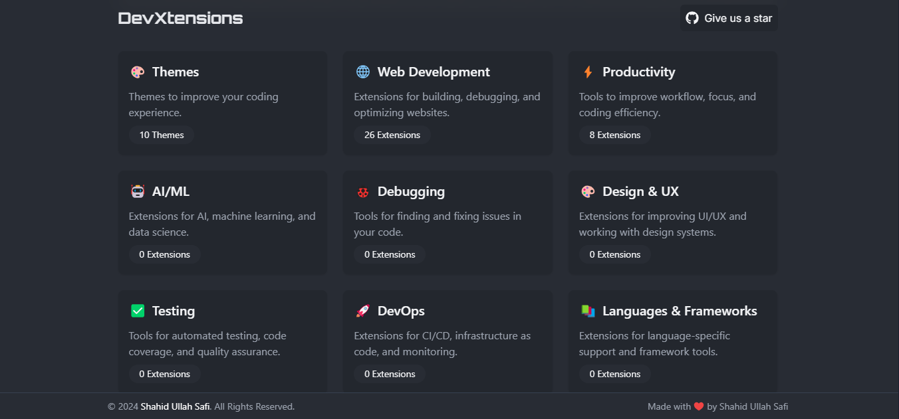
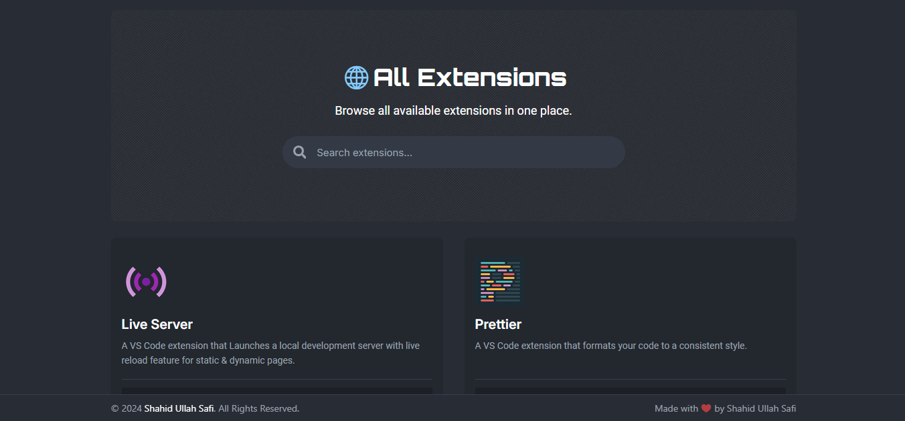

# 🚀 **DevXtensions**

[](LICENSE)  
[](https://github.com/ShahidKhanDev/devxtensions/graphs/contributors)  
[](https://github.com/ShahidKhanDev/devxtensions/stargazers)  
[](https://github.com/ShahidKhanDev/devxtensions/issues)  
[](https://www.netlify.com/)

**DevXtensions** is your ultimate developer toolkit! It curates and showcases powerful extensions to streamline your development process. Whether you're building for the web, desktop, or mobile, DevXtensions has you covered. 💻

---

## ✨ **Features**

- 🌐 **Cross-Platform Compatibility**: Optimized for web, desktop, and mobile environments.
- 🔍 **Powerful Search**: Quickly find extensions with a blazing-fast search.
- 🎨 **Customizable Themes**: Choose from light, dark, or even create your own themes.
- ⚙️ **Easy Copy Commands**: One-click to copy installation commands to your clipboard.
- 🛠️ **Community Contributions**: Add and manage your own extensions through GitHub.
- 📊 **Category Organization**: Neatly categorized for seamless exploration.

---

## 📸 Screenshots

Here are some screenshots of the app's UI:




## 🎥 Demo

View a live demo of the app in action:
[devxtensions demo](https://choosealicense.com/licenses/mit/)

## 📦 **Installation**

Follow these steps to set up **DevXtensions** on your local machine.

### 🛠️ **Prerequisites**

Ensure your environment is ready by having the following installed:

- **[Node.js](https://nodejs.org/)** (v16.x or higher)
- **npm** (Node Package Manager) or **yarn**
- **[Git](https://git-scm.com/)**

---

1. **Clone the repository**:

   ```bash
   git clone https://github.com/ShahidKhanDev/devxtensions.git
   cd devxtensions

   ```

2. Install dependencies

   ```bash
   npm install
   # or
   yarn install
   ```

3. Start the development server:

   ```bash
   npm start
   ```

4. Navigate to http://localhost:3000 in your browser to see DevXtensions in action! 🎉

## 🛠️ Usage

### 🔍 Search Extensions

Search for extensions directly from the app's home page or category view. Results update in real-time as you type!

### 🌐 Filter by Category

Explore extensions by category with an intuitive filtering system.

### ⚙️ Copy Installation Command

Click the "copy" button on any extension to instantly copy its installation command to your clipboard.

---

## 📂 Folder Structure

The **DevXtensions** project is organized in a modular structure to ensure scalability and maintainability. Below is an overview of the folder structure:

    /src
    ├── /assets
    ├── /components
    ├── /data            # Static data
    ├── /pages

### 📁 /data

The /data directory contains all the static data used by the application. This includes the following files:

- `themes.js`: Contains theme configuration options (e.g., light, dark, custom).
- `categories.js`: Defines various extension categories (e.g., Frontend, Backend, Productivity).
- `extensions.js`: Holds data for all extensions displayed in the app, including names, descriptions, and installation commands.

## 🤝 Contributing

We ❤️ contributions! Whether it's adding new extensions, improving the UI, refining the design, or optimizing the functionality, every contribution counts. Here's how you can help make **DevXtensions** even better:

### Ways to Contribute

1. **Static Data**: Expand the collection of themes, categories, or extensions in the `/data` directory.
2. **UI/UX Improvements**: Suggest or implement enhancements to the user interface or overall design.
3. **New Features**: Propose or develop new features to improve the app's functionality.
4. **Code Optimization**: Refactor code for better readability, performance, or maintainability.
5. **Bug Fixes**: Identify and fix bugs or issues in the existing codebase.
6. **Documentation**: Improve or add documentation, including this README, code comments, or tutorials.

### Steps to Contribute

1. **Fork the repository**:
   Click the **Fork** button on the GitHub repository to create your copy.
2. **Create a feature branch**:
   Use a descriptive name for your branch based on the changes you plan to make.

   ```bash
   git checkout -b feature/YourFeatureName
   ```

3. Make your changes:

   - Add new extensions, themes, or categories in the /data directory.
   - Enhance the design in the /components or /pages folders.
   - Fix bugs or optimize code as needed.

4. Commit your changes:
   Use a clear and descriptive commit message.

   ```bash
   git add .
   git commit -m "Add YourFeatureName"
   ```

5. Push your changes
   ```bash
   git push origin feature/YourFeatureName
   ```
6. Submit a pull request:
   Go to the repository on GitHub and open a Pull Request.

---

## 🌟 Support Us

If you find this project helpful, please consider:

- ⭐ Starring this repository.
- 🔗 Sharing it with your friends and network.
- 💬 Providing feedback by opening an issue or joining discussions.

---

## 📧 Contact

- Author: Shahid Ullah Safi
- GitHub: @ShahidKhanDev
- Email: shahidkhandev19@gmail.com
- Country: Afghanistan 

---

## 📜 License

This project is licensed under the MIT License.

# More features coming soon 😊🚀
